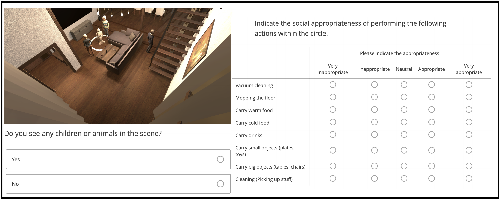

# Mind Your Manners! A Dataset and A Continual Learning Approach for Assessing Social Appropriateness of Robot Actions

This is the official repository that contains the MANNERS all source code for the work of [Jonas Tjomsland](https://www.linkedin.com/in/jtjomsland/?originalSubdomain=no), [Sinan Kalkan](http://ceng.metu.edu.tr/~skalkan/) and [Hatice Gunes](https://www.cl.cam.ac.uk/~hg410/) on ["Mind Your Manners! A Dataset and A Continual Learning Approach for Assessing Social Appropriateness of Robot Actions"](https://www.frontiersin.org/articles/10.3389/frobt.2022.669420/abstract) [1]. It also includes components for extracting uncertainty estimates in predictions.

Our work has two main contributions:

* The MANNERS dataset, which includes various social settings in an indoor environment, including a robot, humans, animals and household objects. Each social setting is labeled for the appropriateness of different robot actions. 
* A continual learning model for social appropriateness, which can continually learn the appropriateness of new robot actions in new environments.

# The MANNERS dataset

The MANNERS dataset constitutes simulated robot actions in visual domestic scenes of different social configurations -- see an example in the following figure: 

<p align="center">
  
</p>

To be able to control but vary the configurations of the scenes and the social settings, MANNERS has been created utilising a simulation environment by uniformly sampling relevant contextual attributes. The robot actions in each scene have been annotated by multiple humans along social appropriateness levels via a window as shown below:

<p align="center">
  
</p>

## Accessing the dataset

For requesting an access to all images, annotation labels and Unity files, please fill in the 
[Access Request Form](https://forms.gle/m1oWhRexWE8E2nnL6).

# The code structure

The code of this project can be seperated in three parts:

### Scripts for data structuring and data analysis of the created and labelled MANNERS-DB dataset:

The scripts in this part are found in the data folder and includes:
- data_analysis.ipynb\
Containing all statistical data analysis
- data_structuring.ipynb\
Cleaning and structuring the data from the Prolific crowd-labelling platform before saving it as csv.

### An extension of the Uncertainty-guided continual learning work by Ebrahimi et al. [2]:
The scripts in this part includes:
- UCB_modified.py\
The original work of Ebrahimi et al. with modifications to the loss function and some minor modifications to record the training process. The "loss" method is our 
work which fascilitates for regression, makes sure the correct output from the model is used to compute the loss and allow for aleatoric uncertainty to be obtained.
- Dataloaders\
The structure of the dataloaders used by Ebrahimi et al. is kept, but modifications are made to fit the MANNERS-DB dataset presented in our work.
- training.py\
The structure of the training script used by Ebrahimi et al. is kept, but modifications are made to fit the parameters and dataloaders necessary for our work.

### An evaluation of the predictive performance:

The scripts in this part includes:
- Evaluation.ipynb\
This is the main evaluation notebook where epistemic uncertainty is obtained and performance is evaluated.
- temp_eval.ipynb\
A notebook used to investigate the model performance at different stages of the Continual learning.

# How to run the code

To run the code, create a new virtual environment with python 3.6.10, cd into the project folder and run "pip install -r requirements.txt"

# Copyright

The restrictions for using the dataset, the Unity files and the code are listed in the following table. Note especially that the Unity files are subject to the license of Unity Asset Store (https://unity3d.com/legal/as_terms).


| Intellectual Property | Commercial Use | Modification | Redistribution |
| --------------------- | -------------- | ------------ | -------------- |
|  Code                 | Yes            | Yes          | Yes (with Attribution) |
| Dataset (Images, Scene Configurations and Annotations) | Yes | No | No | 
| Unity Files [1] | No | No | No |

[1] “[...] you will not reproduce, duplicate, copy, sell, trade or resell any Asset that you have licensed from the Unity Asset Store for any purpose.” -- From https://unity3d.com/legal/as_terms


# How to cite

If you use our work or dataset, please cite the following (available on [Arxiv](https://arxiv.org/abs/2007.12506)):

```
@article{tjomsland2022mind,
  title={Mind Your Manners! A Dataset and A Continual Learning Approach for Assessing Social Appropriateness of Robot Actions},
  author={Tjomsland, Jonas and Kalkan, Sinan and Gunes, Hatice},
  journal={Frontiers in Robotics and AI},
  volume={9},
  pages={1-18},
  year={2022},
  publisher={Frontiers Media SA}
}
```

# Contact

If you have any questions, please contact [Jonas Tjomsland](https://www.linkedin.com/in/jtjomsland/?originalSubdomain=no).

# References

[1] Tjomsland J, Kalkan S, Gunes H., ["Mind Your Manners! A Dataset and A Continual Learning Approach for Assessing Social Appropriateness of Robot Actions"](https://www.frontiersin.org/articles/10.3389/frobt.2022.669420/full), Frontiers in Robotics and AI, Special Issue on Lifelong Learning and Long-term Human-Robot Interaction, 9:1-18, 2022.

[2] Ebrahimi, Sayna, et al. "Uncertainty-guided continual learning with bayesian neural networks." arXiv preprint arXiv:1906.02425 (2019).

